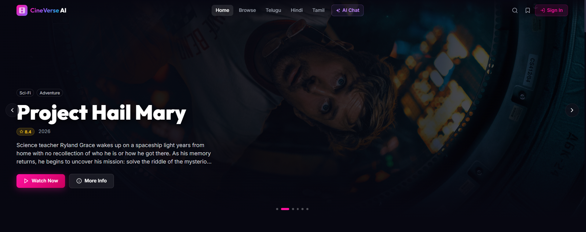
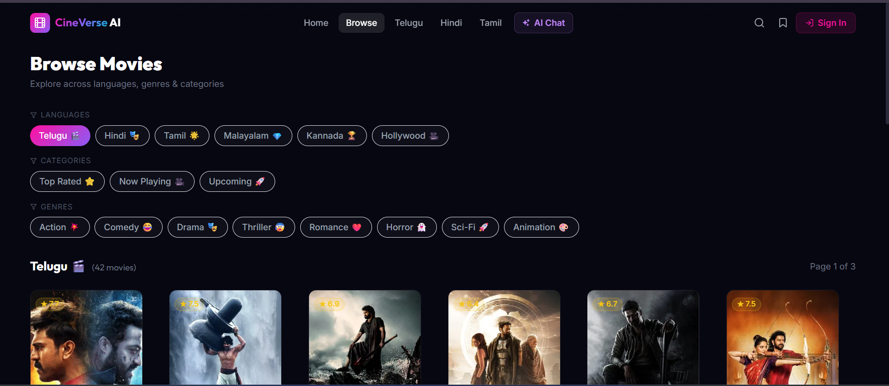
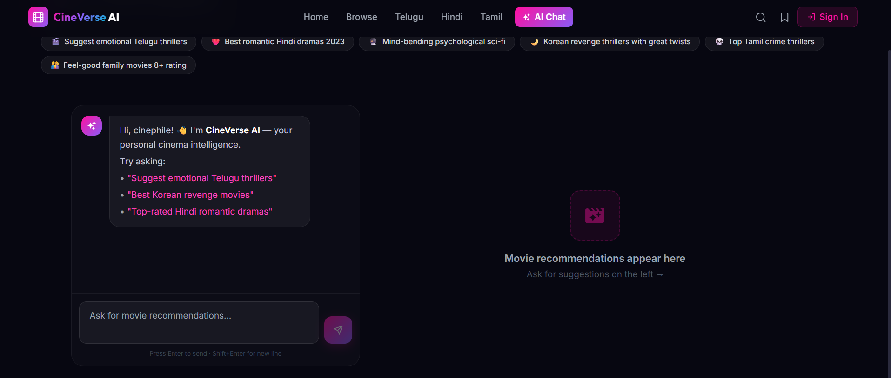
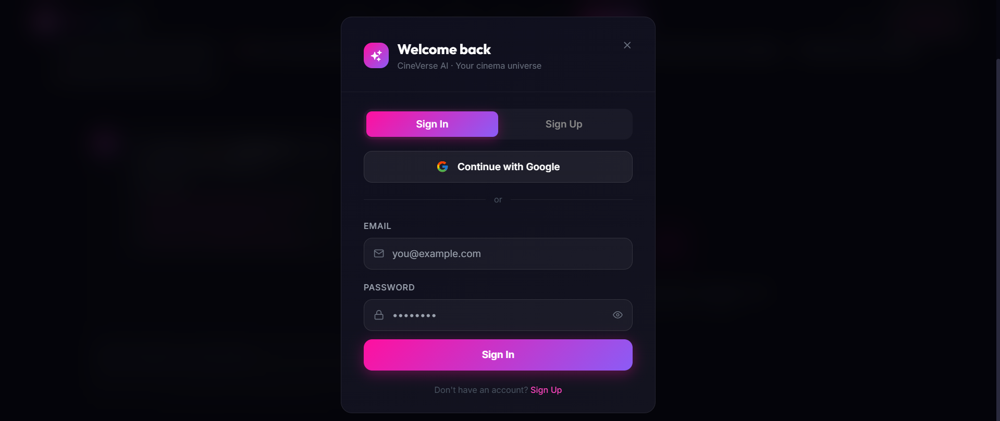
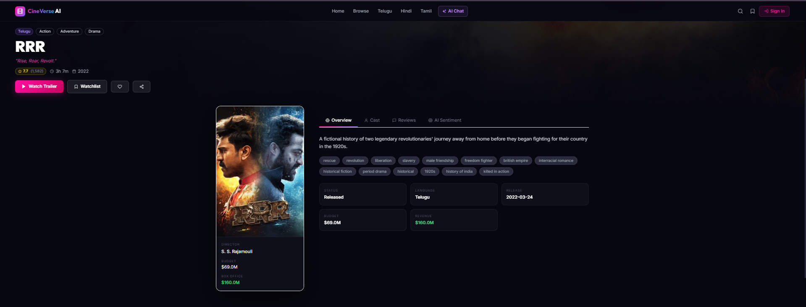
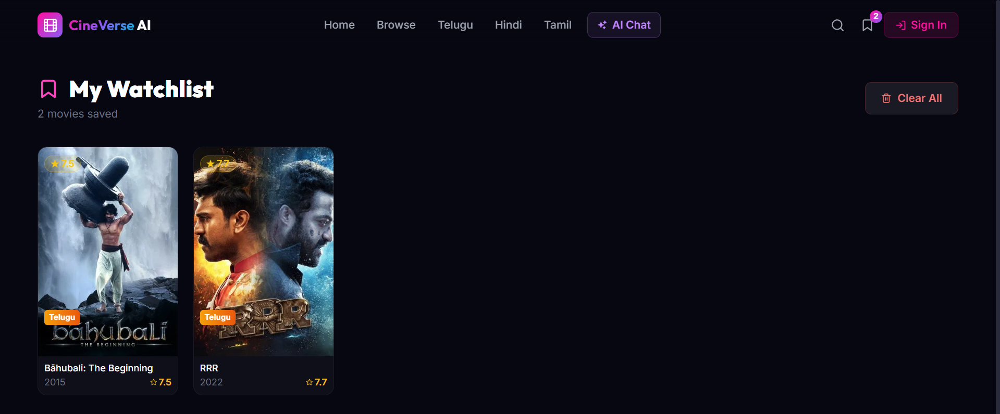

<div align="center">

# 🎬 CineVerse AI

### AI-Powered OTT Movie Discovery Platform

[](https://react.dev/)
[](https://vitejs.dev/)
[](https://nodejs.org/)
[](https://expressjs.com/)
[](https://firebase.google.com/)
[](https://ai.google.dev/)
[](https://www.themoviedb.org/)
[](https://vercel.com/)
[](https://render.com/)

**[🌐 Live Demo](https://cine-verse-ai-production.vercel.app/)** · **[🔧 Backend API](https://cineverse-ai-production.onrender.com/api/health)**

</div>

---

## 🌟 What is CineVerse AI?

CineVerse AI is a **production-grade, full-stack OTT-style movie discovery platform** that combines the power of **Google Gemini AI**, **TMDB's movie database**, and **Firebase Authentication** into a cinematic Netflix-inspired experience.

> Ask in natural language: *"Suggest emotional Telugu thrillers"* → Get AI-curated movie cards, instantly.

---

## ✨ Features

| Feature | Description |
|---|---|
| 🤖 **AI Chat Recommender** | Natural language movie recommendations via Google Gemini |
| 🔐 **Firebase Authentication** | Email/password + Google OAuth with persistent session |
| 🎬 **Cinematic Hero Carousel** | Auto-sliding hero with backdrop blur and animated overlays |
| 🔖 **Smart Watchlist** | localStorage persistence with real-time badge counter |
| 🎭 **Trailer Modal** | YouTube iframe with cinematic overlay and ESC support |
| 🌍 **Multi-language Browse** | Telugu, Hindi, Tamil, Malayalam, Kannada, English, Korean |
| 🎭 **Genre & Category Filters** | 8 genres × 3 categories with paginated grid |
| 🔍 **Live Search + Suggestions** | Debounced typeahead with poster previews |
| 👤 **Actor Modal** | Full actor filmography on click |
| 🧠 **AI Sentiment Panel** | Movie sentiment analysis via AI engine |
| 📱 **Mobile-First Responsive** | Optimized for all screen sizes |
| ⚡ **Performance Optimized** | Lazy loading, code splitting, React Query caching |
| 💀 **Loading Skeletons** | Shimmer placeholders for every data state |
| 🛡️ **Error Boundaries** | Route-level error recovery with retry |

---

## 🛠️ Tech Stack

### Frontend
- **React 19** + **Vite 8** — fast HMR development
- **Tailwind CSS 3** — utility-first styling
- **Framer Motion** — cinematic animations
- **React Query (TanStack)** — server state + caching
- **React Router v7** — client-side routing with lazy loading
- **Firebase SDK** — authentication
- **React Hot Toast** — toast notifications
- **React Icons** — icon library

### Backend
- **Node.js + Express 4** — REST API server
- **TMDB API** — movie data source (500K+ titles)
- **Google Gemini 1.5 Flash** — AI recommendation engine
- **Helmet + CORS + Rate Limiting** — production security
- **node-cache** — in-memory API response caching
- **Morgan + Compression** — logging and gzip

### Infrastructure
- **Vercel** — frontend CDN deployment
- **Render** — backend auto-scaling deployment
- **Firebase** — Google Auth + user management

---

## 🏗️ Architecture

```
CineVerse AI
├── frontend/                    # React + Vite SPA
│   └── src/
│       ├── components/          # Reusable UI components
│       │   ├── Navbar.jsx       # Sticky nav with auth + search
│       │   ├── HeroCarousel.jsx # Auto-sliding hero section
│       │   ├── MovieCard.jsx    # Hover-animated poster card
│       │   ├── MovieRow.jsx     # Horizontal scrollable row
│       │   ├── TrailerModal.jsx # YouTube trailer overlay
│       │   ├── ActorModal.jsx   # Actor details + filmography
│       │   ├── AuthModal.jsx    # Login / Signup modal
│       │   ├── SentimentPanel.jsx # AI sentiment display
│       │   ├── LoadingSkeleton.jsx # Shimmer loaders
│       │   └── ErrorBoundary.jsx # Route-level error recovery
│       ├── pages/               # Route-level page components
│       │   ├── Home.jsx         # Hero + content rows
│       │   ├── Browse.jsx       # Filter grid + pagination
│       │   ├── Search.jsx       # Search results page
│       │   ├── MovieDetail.jsx  # Full detail + tabs + recs
│       │   ├── Watchlist.jsx    # Saved movies grid
│       │   ├── AiChat.jsx       # AI Chat recommender
│       │   └── NotFound.jsx     # 404 page
│       ├── context/             # React contexts
│       │   └── AuthContext.jsx  # Firebase auth state
│       ├── hooks/               # Custom React hooks
│       │   ├── WatchlistContext.jsx # Watchlist state + actions
│       │   ├── useWatchlist.js  # Watchlist hook (re-export)
│       │   └── useDebounce.js   # Input debouncing
│       └── services/            # API layer
│           ├── api.js           # Axios client + all endpoints
│           └── firebase.js      # Firebase app init
│
├── backend/                     # Node.js + Express API
│   └── src/
│       ├── routes/
│       │   ├── movies.js        # Movie detail + videos
│       │   ├── search.js        # Search + suggestions
│       │   ├── discover.js      # Home sections + browse
│       │   ├── trending.js      # Trending hero
│       │   ├── actors.js        # Actor details
│       │   ├── recommendations.js # AI recommendation engine
│       │   └── ai.js            # Gemini chat endpoint
│       ├── services/            # Shared service modules
│       └── app.js               # Express app + middleware
│
└── ai-engine/                   # Python sentiment analysis
    └── (FastAPI + ML models)
```

---
## 📸 Screenshots

### 🏠 Home Page


---

### 🎬 Browse Movies


---

### 🤖 AI Chat


---

### 🔐 Login Page


---

### 🎥 Movie Detail


---

### ⭐ Watchlist

---

## 🚀 Quick Start

### Prerequisites
- Node.js ≥ 18
- Git
- TMDB API key (free at [themoviedb.org](https://www.themoviedb.org/))
- Gemini API key (free at [aistudio.google.com](https://aistudio.google.com/))
- Firebase project (free at [console.firebase.google.com](https://console.firebase.google.com/))

### 1. Clone the repository
```bash
git clone https://github.com/LeelaSaiLokesh/CineVerse-AI-Production.git
cd CineVerse-AI-Production
```

### 2. Backend setup
```bash
cd backend
npm install
```

Create `backend/.env`:
```env
PORT=5000
NODE_ENV=development
TMDB_API_KEY=your_tmdb_api_key
TMDB_BASE_URL=https://api.themoviedb.org/3
GEMINI_API_KEY=your_gemini_api_key
FRONTEND_URL=http://localhost:5173
```

```bash
npm run dev   # starts on http://localhost:5000
```

### 3. Frontend setup
```bash
cd frontend
npm install
```

Create `frontend/.env`:
```env
VITE_API_BASE_URL=http://localhost:5000

# Firebase (optional — auth works in demo mode without it)
VITE_FIREBASE_API_KEY=your_firebase_api_key
VITE_FIREBASE_AUTH_DOMAIN=your_project_id.firebaseapp.com
VITE_FIREBASE_PROJECT_ID=your_project_id
VITE_FIREBASE_STORAGE_BUCKET=your_project_id.appspot.com
VITE_FIREBASE_MESSAGING_SENDER_ID=your_sender_id
VITE_FIREBASE_APP_ID=your_app_id
```

```bash
npm run dev   # starts on http://localhost:5173
```

---

## 🔑 Environment Variables

### Frontend (`frontend/.env`)
| Variable | Required | Description |
|---|---|---|
| `VITE_API_BASE_URL` | ✅ Yes | Backend base URL |
| `VITE_FIREBASE_API_KEY` | Optional | Firebase project API key |
| `VITE_FIREBASE_AUTH_DOMAIN` | Optional | Firebase auth domain |
| `VITE_FIREBASE_PROJECT_ID` | Optional | Firebase project ID |

### Backend (`backend/.env`)
| Variable | Required | Description |
|---|---|---|
| `TMDB_API_KEY` | ✅ Yes | TMDB API v3 key |
| `GEMINI_API_KEY` | Optional | Enables AI Chat feature |
| `PORT` | Optional | Server port (default: 5000) |

---

## 🔥 Firebase Authentication Setup

1. Go to [Firebase Console](https://console.firebase.google.com/)
2. Create a new project
3. Enable **Authentication** → Sign-in methods → Enable **Email/Password** and **Google**
4. Go to **Project Settings** → **General** → scroll to **Your apps** → Add a **Web app**
5. Copy the config values to your `frontend/.env`

---

## 🤖 AI Chat Setup

1. Go to [Google AI Studio](https://aistudio.google.com/app/apikey)
2. Create a free API key
3. Add to `backend/.env` as `GEMINI_API_KEY`
4. Restart the backend server

**Example queries:**
- *"Suggest emotional Telugu thrillers"*
- *"Best Korean revenge movies with great twists"*
- *"Top-rated Hindi romantic dramas from 2022"*
- *"Mind-bending psychological sci-fi films"*

---

## 🌐 API Endpoints

| Method | Endpoint | Description |
|---|---|---|
| `GET` | `/api/health` | Health check |
| `GET` | `/api/trending/hero` | Hero carousel movies |
| `GET` | `/api/discover/home-sections` | All home page sections |
| `GET` | `/api/discover/language/:lang` | Movies by language |
| `GET` | `/api/discover/genre/:genre` | Movies by genre |
| `GET` | `/api/movies/:id` | Full movie details |
| `GET` | `/api/search?q=` | Movie search |
| `GET` | `/api/search/suggestions?q=` | Typeahead suggestions |
| `GET` | `/api/actors/:id` | Actor + filmography |
| `GET` | `/api/recommendations/:id` | AI-based recommendations |
| `POST` | `/api/ai/chat` | Gemini AI chat recommender |

---

## 📦 Deployment

### Vercel (Frontend)
```bash
cd frontend
npm run build
# Deploy dist/ to Vercel
# Set all VITE_* env vars in Vercel dashboard
```

### Render (Backend)
- Connect GitHub repo
- Root directory: `backend`
- Start command: `npm start`
- Add all env vars in Render dashboard

---

## 🎯 Performance

- **Code splitting** — each page is a separate JS chunk (lazy loaded)
- **React Query caching** — 5-minute stale time, 10-minute cache
- **Image lazy loading** — `loading="lazy"` + `decoding="async"`
- **Debounced search** — 300ms debounce prevents excessive API calls
- **Gzip compression** — enabled on backend via `compression` middleware
- **Rate limiting** — 500 req/15min per IP to prevent abuse

---

## 👨‍💻 Author

**KHAIRULLAH SHAIK**

Built as a production-grade portfolio project demonstrating full-stack engineering with React, Node.js, Firebase Auth, and Google Gemini AI.

---

<div align="center">

**⭐ Star this repo if you found it useful!**

Made with ❤️ and a lot of movies 🎬

</div>

## ?? AI Chat Status

AI Chat integration with Gemini API is implemented in backend architecture.
Live deployment may require Google Cloud billing activation for production usage.
